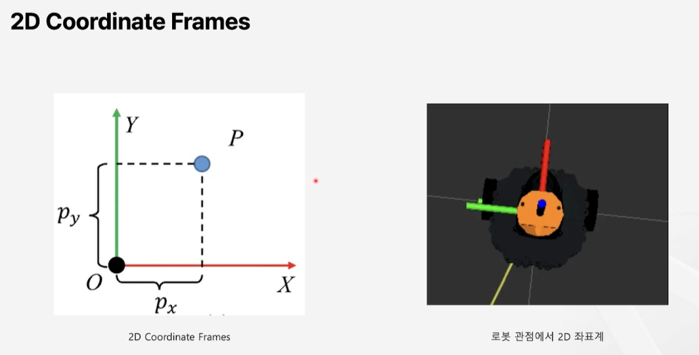

# Ch01-01. SLAM 개요 및 선수 지식

---

# SLAM 이란?

- `Simultaneous : 동시적`
- `Localization : 위치 추정`
- `And : 및`
- `Mapping : 지도 작성`
- SLAM 알고리즘은 이 두가지 문제를 동시에 해결하기 위해 설계됨
    - Localization과 Mapping을 동시에 수행
- 다양한 센서 데이터를 사용하여 주변 환경을 인식하고, 이를 바탕으로 환경의 지도를 생성하면서 로봇의 위치를 실시간으로 추적
    - `로봇은 이전에 본 적 없는 환경에서도 자신이 어디에 있는지 알고, 그 환경 지도를 만들어낼 수 있음`

## Localization

- 지도가 주어진 상황에서 공간 속 내 위치 찾기

## Mapping

- 이동 정보가 주어진 상황에서 지도 만들기
- 자신의 위치를 중점으로 주변 환경을 스캔하여 하나의 지도로 만듦
- 왔던곳으로 되돌아 왔을 경우 지도 업데이트

---

# 선수 지식

## Coordinates and Transformations

- 로봇 관점에서 x축과 y축 좌표계가 다름

### 3D Coordinate Frames

- base_link
    - 로봇의 주(main) 참조 프레임 ( 주로 로봇의 중심 )
    - 모든 동적 움직임 및 센서 데이터는 이 프레임을 기준으로 계산되고 표현
- base_scan
    - 2D LiDAR가 측정하는 데이터의 원점을 나타내며, 센서의 물리적 위치와 방향을 기준으로 설정

### 2D LiDAR Data

- 출력 결과의 ranges 필드는 아래 규칙에 다라 base_scan 프레임에서 주어진 각도록 측정한 거리(m)를 나타냄
    - range[0] : angle_min의 각도(rad)에 해당되는 측정 값
    - range[1] : angle_min + angle_increment의 각도(rad)에 해당되는 측정 값
    - range[2] : angle_min + 2*angle_increment의 각도(rad)에 해당되는 측정 값
    - range[3] : angle_min + 3*angle_increment의 각도(rad)에 해당되는 측정 값
    - …

ranges = r

theta는 0도 부터 angel_increment 만큼 증가

따라서 x 값은 ranges 값과 cos(theta) 한 값

y값은 ranges 값과 sin(theta) 한 값

### 문 중앙까지의 위치 결정하기

- 동차좌표계 ( Homogeneous Coordinates )
    - 이 시스템은 기하학적 변환을 더 효율적으로 수행할 수 있게 해주며, 특히 로봇 공학과 컴퓨터 그래픽스 분야에서 널리 사용
        - 평행 이동 ( translation ) 과 회전 ( rotation )을 하나의 행렬로 표현 가능
        - 무한대에 있는 점
        - 원근 투영 ( perspective projection )을 선형 변환으로 표현할 수 있음
    - 기존의 3차원 좌표 ( x, y, z )에 추가적인 차원을 더하여 ( x, y, z, w )로 표현
        - 일반적으로 w는 1로 설정되며, 이는 변환 행렬을 이용하여 변환을 쉽게 표현할 수 있게 함
            - w = 1 이라면 점이고, 0 이라면 벡터를 표현

- 이동 변환 ( Translation )
    - 3차원 공간에서의 이동 변환은 다음과 같은 4 x 4 행렬로 표현

- 회전 변환 ( Rotation )
    - 3차원 공간에서의 회전 변환은 각 축을 기준으로 하는 4 x 4 행렬로 표현
    - 회전 순서에 따라 결과가 달라질 수 있음

- 합성 변환 ( Combined Transformations )
    - 이동 변환과 회전 변환을 동차 좌표계에서 결합하면 하나의 행렬로 표현
        
        
        
    - 점 변환 예시
        
        
        
- base_link 프레임 기준으로 base_scan 프레임이 ( -0.032, 0.0, 0.172 )에 있다고 표현될 때, base_link 프레임에서 문 중심의 좌표를 계산할 수 있음

- Linear Transformations을 활용해 좌표계를 변환하면, odom 프레임을 기준으로 문의 중심 ( P )을 표현할 수 있음
    - P ( 문의 중심 )의 기준 좌표계 변환 : base_scan → base_link → odom
    - odom  프레임을 기준으로 문의 중심이 표현되었기 때문에 로봇을 문의 중심으로 이동시킬 수 있음
        
        
        

### SLAM & Nav2에서의 필수 개념 - TF

- 여러 로봇 구성 요소 간의 좌표계를 효율적으로 다루기 위한 좌표 변환 라이브러리
- 로봇 시스템에서 다양한 센서, 프레임, 그리고 여러 장치들이 각기 다른 위치와 방향을 가지므로 이를 일관성 있게 연결하기 위해 tf가 사용됨

